# Overview

I got an Aula F75 keyboard for use on the couch when watching movies off of my computer since it was wireless, backlit, and had an easy volume adjustment control to find when the keyboard would go to sleep. However, I only found out after getting the keyboard that turning the rotary knob doesn't wake the keyboard up when it goes to sleep. Enter an ATTiny85 to save the day! It sits between the rotary knob and the keyboard, and will inject a shift keypress to wake the keyboard up if it's in standby. It consumes <1ma, so shouldn't really impact the battery life of the keyboard at all.


## Materials

- 1 x Arduino nano for programming the ATTiny85
- 1 x ATTiny85
- 1 x 10μf ceramic capacitor
- 1 x 2N7000 mosfet
- 1 x 3.3kΩ resistor
- 1 x 10kΩ resistor
- 1 x 1N4007 diode
- Jumper wire
- Soldering Iron/Solder
- Knife
- VHB (double sided tape) or a glue gun
- (Optional) 1 x 8 pin DIP Socket

## Programming the ATTiny85

You need to use the Arduino IDE to flash the ATTiny85 with the firmware to wake the keyboard up. 
1. Grab the [Arduino IDE](https://www.arduino.cc/en/software/) and install it on your platform of choice.
2. Under preferences, add `https://drazzy.com/package_drazzy.com_index.json` to the list of `Additional Board Manager URLs`.
3. Using the boards manager on the left, search for the `ATTinyCore` package and install it. 
4. You'll need to set up your Arduino nano as a programmer first so you can program the ATTiny85. Click on `File -> Examples -> ArduinoISP -> ArduinoISP` to open the sketch, In the drop down beside the checkmark and arrow below the menu bar, click it and change the board to `Arduino Nano`. You can then click the `Upload` error to program it. *Note* You may need to select `Tools -> Processor -> ATMega328P (Old Bootloader)` if you have a cheap clone device as the programming will fail otherwise.
5. Open the `attiny85.ino` sketch in this repo.
6. Use the board select dropdown to select `ATtiny25/45/85 (No Bootloader)`.
7. Under `Tools`, set the `B.O.D. Level` to disabled
8. In `Tools`, set the programmer to `Arduino as ISP`
9. You'll now need to hook up the ATTiny85 to the Arduino for flashing. Connect your Arduino and capacitor like in [this diagram from Digikey](http://sc-b.digikeyassets.com/-/media/MakerIO/Images/blogs/2022/How%20to%20Flash%20the%20Arduino%20Bootloader%20to%20an%20ATTiny85%20IC/schemeit_2.jpg)
10. Click on `Tools -> Burn Bootloader`
11. Upload the sketch to the ATTiny85.
12. We need to burn the fuses on the ATTiny85 to allow us to use the reset pin as an input. This can be undone using a high voltage programmer, but make sure the previous steps succeded before running this. You'll need to use the tool `avrdude` with a similar command from a terminal - replacing the serial port with whatever your Arduino is connected to (mine is on `/dev/ttyUSB0')

```
avrdude -c arduino_as_isp -p attiny85 -P /dev/ttyUSB0 -U hfuse:w:0x5F:m
```

After you have run this step, you will not be able to reprogram the ATTiny85 until you use a high voltage programmer to reset it.

## Wiring the Keyboard

1. Slowly pop the cover off the back by wedging a plastic spudge between the case and work your way around the outside. Be slow and careful to ensure you don't snap anything.
2. Before the two halves seperate, carefully disconnect the two ribbon cables and the battery jumper. To disconnect the ribbon cabels, you will need to pull the little back tab in the direction of the cable to release it.
3. Take the PCB out (you may need to pop out the little cover plate that has the text for the switch/USB port), and unscrew the rotary knob component from the base.
4. Slowly peel off the foam on the back of the PCB. I started in one corner and worked my way across pulling evenly to not rip anything.
5. On the pads near the bottom of the PCB, solder a 25cm jumper to the `VDD` pad, then a 25cm and 10cm jumper to the `GND`
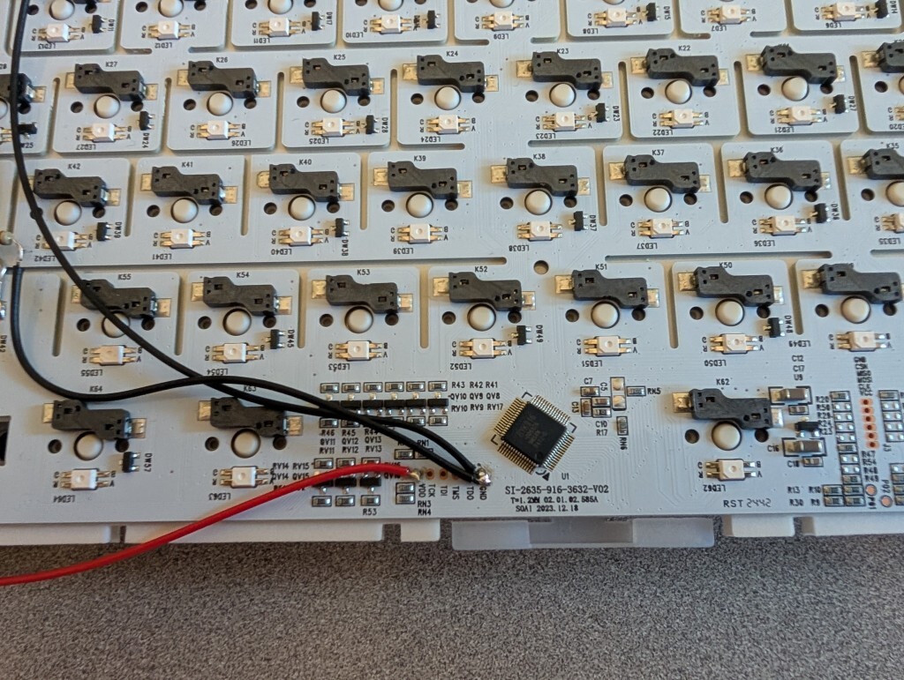
6. Locate the connector for the shift key (it's one row up, and three in from the left side). Connect the source pin to the left side of the connector, the drain to the right, and then the 10kΩ resistor to the gate, followed by the 10cm jumper to ground. Also attach another 15cm jumper to the gate.
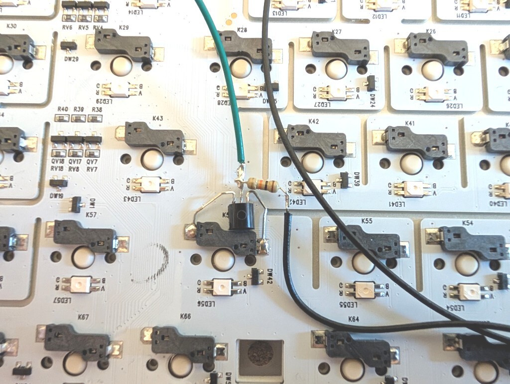
7. Reattach the foam to the PCB, threading the jumper wires through nearby holes
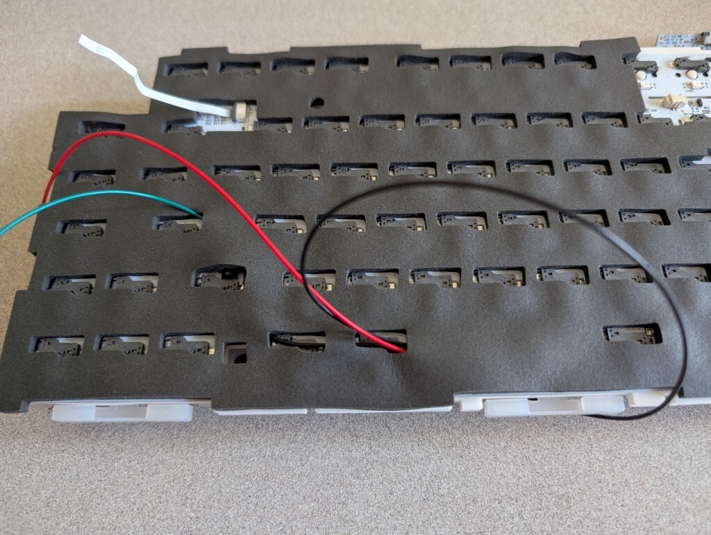
8. Cut out a 3cm wide by 2.5cm tall chunk of the silicon to make room for the ATTiny85.
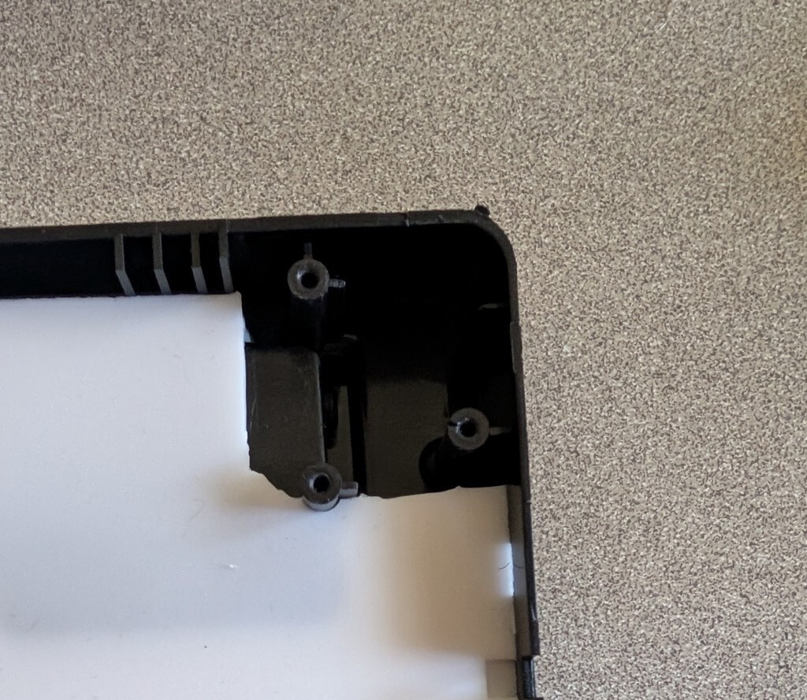
9. On the rotary knob, cut the two outside pins right at the base of the PCB on the knob on the side that has three pins. Attach a 8cm jumper to each of these pins. Note they should not be touching the original pads anymore
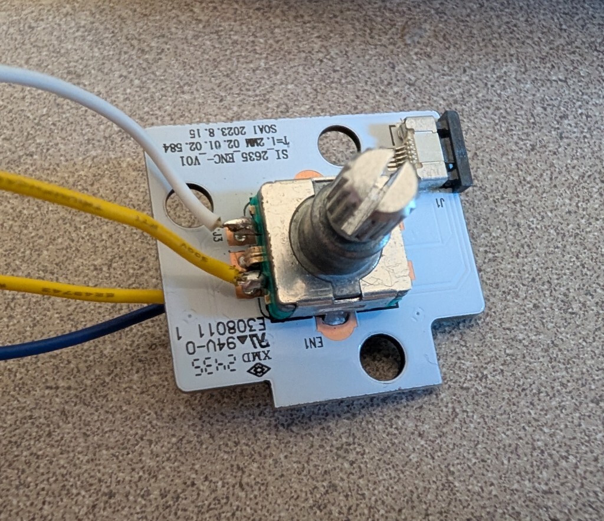
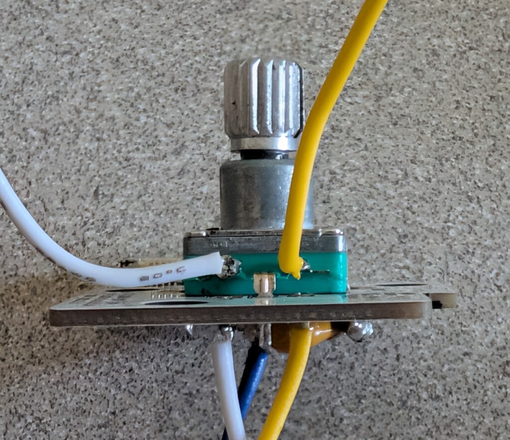
10. On the bottom side, attach another two 8cm jumpers to the pads of the pins you just cut. You will also connect the diode, the capacitor and the 3.3k resistor together as show in the image - one end of the capacitor and resistor are attached to the big blade in the middle of the rotary encoder, while the other end of both the capactior and resistor is connected to the ribbon end of the diode and the jumper wire). The other end of the diode is connected to one of the pad that is furthest away from the ribbon cable connector.
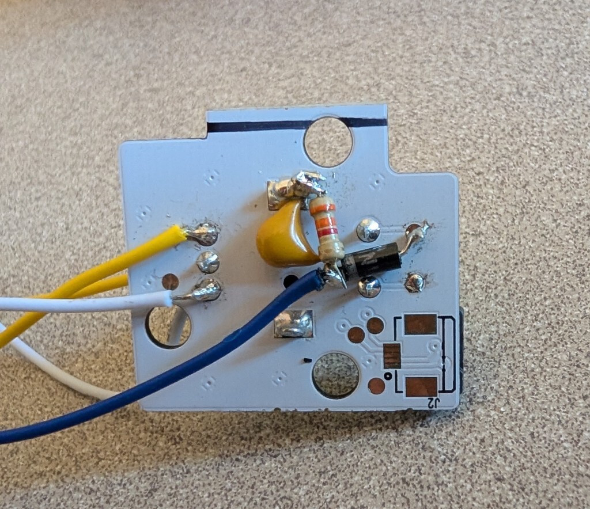
*Note:* We need to add the cap, diode and resistor because this pin emits a PWM signal that may not always be high when we are reading it from the ATTiny. The capacitor smooths it out, while the resistor is there to actually bleed it down and let it discharge. The diode prevents the capacitor from backfeeding whatever is generating this signal on the keyboard.
11. Clip off the skiny portions of the pins on the ATTiny, and use some VHB or hot glue to attach the ATTiny to the rotary encoder on its back. I found it helpful to use a silver sharpie to mark Pin 1 on the underside.
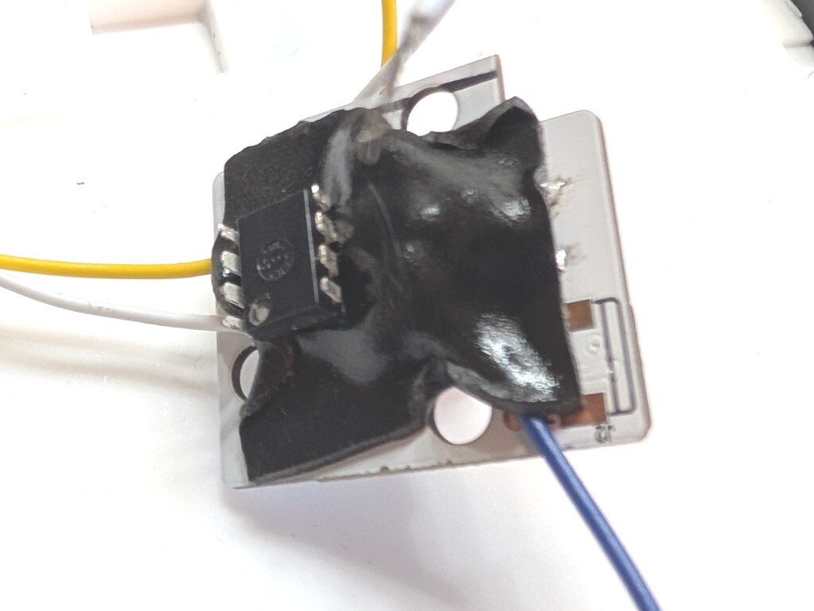 Alternatively, you can use a 8 pin socket and solder to the socket so you can easily pop out the ATTiny85 for reprogramming.
12. Solder the two wires that were attached to the bottom of the encoder board to pins 2 and 3, while attaching the wires from the top to pins 6 and 7. Make sure that you match the wires across the ATTiny, or your volume control will be reversed. I found it useful to make the wires as short as possible, and to tuck the wires from the top into the little notch on the board. Finally, attach the jumper wire that was connected to the diode to pin 1. Take your time between pins as you will want the chip to cool down to prevent it from getting too hot and frying.
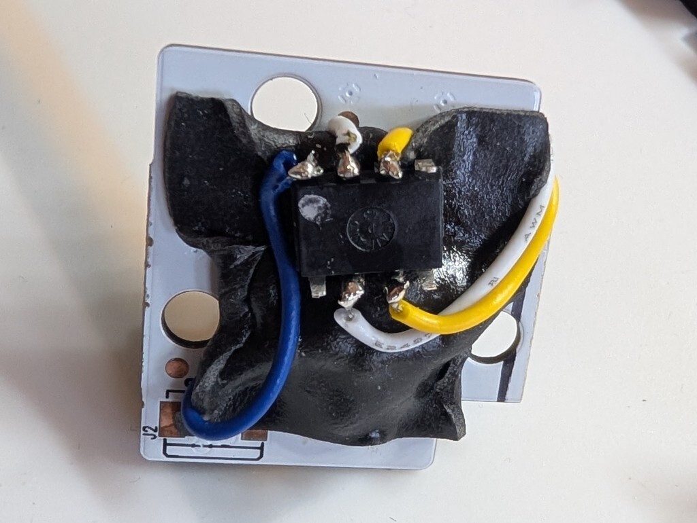
13. Connect the remaining wires, the VDD wire to pin 8, the GND wire to pin 4, and the shift key wire to pin 5.
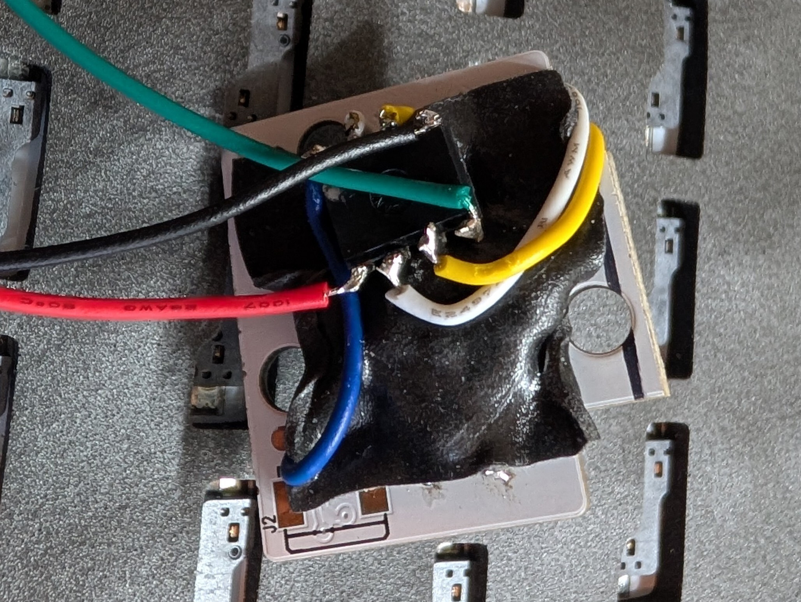
14. Mount the rotary encoder back on the bottom part of the case (make sure to push any VHB that is near the mounting holes to the side to make sure it sits flush on the standoffs. Reattach the ribbon cables and battery jumper. You can do a quick test to make sure everything works before you button up the case.
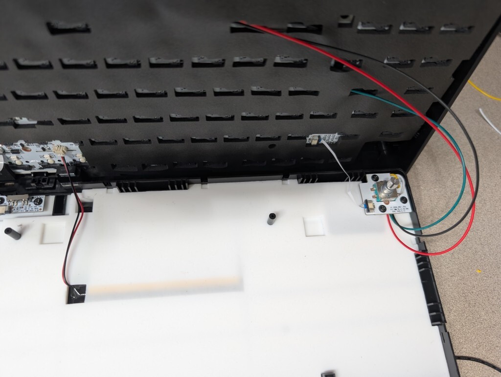
15. I found it easiest to place the keyboard PCB on the bottom section, then insert the top piece. To do this you may have to take out the little covering with the description of the switch/USB port by pressing in on the little pins. Once you have everything seated and click the top back in, you can re-attach the cover. Make sure to align the switch on the little power board with the switch on the top cover before you press it down. It will take a bit of force to get it to attach, but you shouldn't have to press too hard. If it doesn't feel right, it probably isn't, make sure that you're not pinching any of the wires we added.

## TODO

While writing all this up, I realized it may be possible to avoid having to burn the fuses/simplify the ISR routine to just wake the board if necessary - you could maybe just tap the two rotary inputs and leave them as `INPUT_PULLUP`, so the keyboard would still read them as normal. However I only thought of this after I had closed everything back up and this works for me, so someone else can figure out if that would work if they cared.
